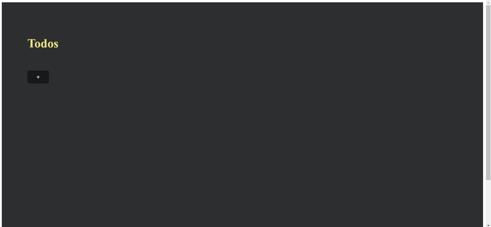
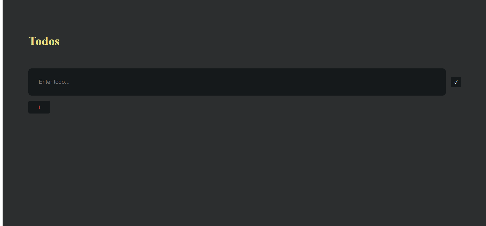
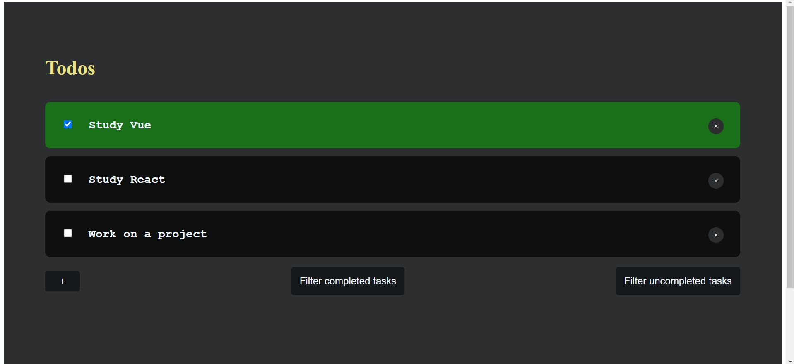
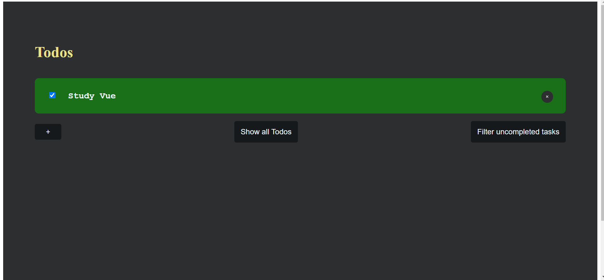
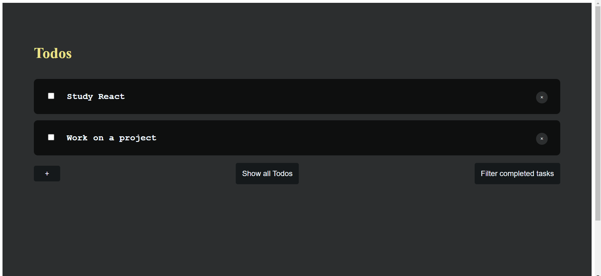
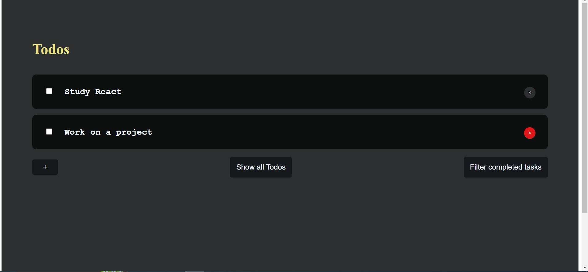

# Vue-To-Do

This is a simple to-do app created by VueJs for learning purpose

## Installation

```bash
   - git clone git@github.com:ahmedasad236/Vue-To-Do.git

   - cd Vue-To-Do

   - npm install

   - npm run serve
```

## Tools

- Vue js

## Features

- Create a task and add it to the list
- Mark the task as a completed one
- Remove the task from the list of todos
- Filter the completed/uncompleted tasks

## Snapshots

- 

- 

- 

- 

- 

- 
